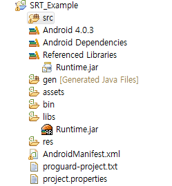
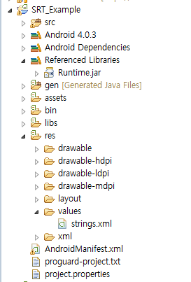
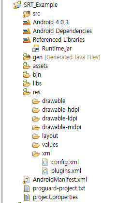

<!--
{
	"id": 6200,
	"title": "Android Runtime 하이브리드앱 개발",
	"outline": "Android Runtime을 통하여 하이브리드앱을 개발하는 환경 및 절차를 설명한다.",
	"tags": ["runtime"],
	"order": [6, 2],
	"thumbnail": "6.2.00.android.png"
}
-->

-------------------

# Android Runtime 하이브리드앱 개발 

-------------------

### Android Runtime 하이브리드앱 개발 환경 

 - 다음 링크에서 Android 용 코너스톤 런타임을 다운로드 받을 수 있다. 
 - [Android 용 코너스톤 런타임 (Android 용 하이브리드앱 개발환경) 다운로드](http://cornerstone.sktelecom.com/download/cornerstone-runtime-Android-0.9.2.zip) 

### Android Runtime 하이브리드앱 개발 환경 구조 

1) src - Plugin 개발시에 작성하는 Java Native Code

2) asset - 실제 하이브리드앱의 웹 리소스 (HTML/CSS/JS/IMG) 와 Runtime Java Script Library 가 저장되는 위치 
	
-	**assets/www** : 하이브리드앱의 저장 위치 
-	**assets/www/index.html** : 하이브리드앱의 첫 실행 파일 

3) libs - Webview 를 이용하여 Device 의 단말 접근 기능을 제공하는 Device API가 포팅된 Android Library 위치 

-	**Runtime.jar** : Webview 및 Device API가 포팅된 Java Library

4) drawable - Device에 보여지는 Icon 및 Splash Image를 저장하는 위치 

-	**icon.png** : Device에 보여지는 Icon
-	**splash.png** : 하이브리드앱 실행 초기에 보여지는 Splash Image (Optional) 

5) values , xml - 하이브리드앱의 Name 및 Runtime 기능 설정을 할 수 있는 폴더 

-	**value/string.xml** : 하이브리드앱의 Name을 설정하는 파일 
-	**xml/config.xml** : Device의 Orientation(portrait , landscape , auto) , Splash Image , Push 사용 여부 등을 를 설정하는 파일 

6) AndroidManifest.xml : 하나의 Native Application으로써의 고유한 Package 명을 지정하는 파일, 하드웨어 가속 GPU 렌더링 사용여부를 설정하는 파일.

 

### Android 하이브리드앱 개발 절차

**step 1.**  Cornerstone 개발환경을 이용하여 Android 하이브리드앱 Template를 받으면 Lib 폴더에 **Runtime.jar가 기본으로 포함**되어 있다.

**step 2.**  하이브리드앱 개발자는 assets 폴더 내부에 .html , .js , .css 와 같은 하이브리드앱 소스 파일을 작성하여야 하며 시작 파일은 반드시 index.html 이어야 한다. **SRT-0.9.2.js는 하이브리드앱 개발 환경 Template의 기본 포함된 파일**이다. 

-	초기 페이지인 **index.html**을 생성한다. 

		<html>
		<head>
		
		</head>
		<body>
			Hello Cornerstone.
		</body>
		</html>
	
-	특정 웹페이지 내부에서 Runtime Device API를 사용하고 할 때에는 아래와 같이 Java Script Library를 선언한다.
 
		

	> 하이브리드앱에서의 Device 의 해상도에 상관 없이 스크린에 Fix되게 출력하는 방법

	- 모바일 웹에서는 Device에 따라 환경적인 차이가 많아서 고려해야 할 사항들이 몇 가지 있다. Webpage를 Device 해상도 별로 제작 할 수 있는 것도 아니고 어떤 Device가 접속했는지를 일일이 구분하여 서버상에서 Page를 내려줄 수 있는 것도 아니다. 이런 크로스브라우징 문제를 해결하기 위해서 Media Query를 사용하기를 권장한다. 

	-	해상도가 다른 Device 에 따라 화면에 Fix하게 출력 하고 싶을 경우 아래와 같이 **Media Query**를 이용하여 Device 해상도에 맞는 CSS를 적용하도록 한다. 

		>	Style.css Example

			body {background-color:#000;}
			/* Galaxy Note 1 */ 
			@media screen and (max-width:801px) { #wrapper img{width:800px; height:1204px;}}
		
			/* Ipad2 */ 
			@media screen and (max-width:769px) { #wrapper img{width:769px; height:1204px;}}
		
			/* Galaxy S3 */
			@media screen and (max-width:721px) { #wrapper img{width:720px; height:1204px;}}
		
			/* Galaxy S2 */
			@media screen and (max-width:481px) { #wrapper img{width:480px; height:724px;}}

		> Index.html Example

			<!DOCTYPE HTML>
			<html>
			<head>
			<meta http-equiv="Content-Type" content="text/html; charset=utf-8" />
			<meta name = "viewport" content = "user-scalable=no, width=device-width, target-densitydpi=device-dpi"/>
			
			<title>Media query test</title>
			<link href="style.css" rel="stylesheet" type="text/css" />
			
			</head>
			
			<body>
			 

				
			

			</body>
			</html>

**step 3.**  Res 폴더 내부에 하이브리드앱 개발자가 사용하고자 하는 아이콘 이미지를 **icon.png**의 이름으로 삽입한다. 
		

**step 4.** **AndroidManifest.xml** 파일 내부의 Package 명을 개발자가 변경을 해야 한다. 이는 고유한 값으로 Android 시스템 내부의 중복된 어플이 설치되지 않도록 한다. 

-	기본적인 Manifest 파일의 형식 

		<manifest xmlns:android="http://schemas.android.com/apk/res/android" android:windowSoftInputMode="adjustPan"
    	package="co.kr.skt.testapp.test" android:versionName="1.1" android:versionCode="5">

- GPU 하드웨어 가속 렌더링을 사용하고 싶다면 아래와 같이 Application Tag에 HardwareAccelerated 를 true로 설정 한다. 이는 웹 앱이 디바이스에서 사용하는 메모리 점유율을 늘어나지만 부드러운 2D Image 렌더링을 가능하게 한다. (default는 생략됨) 

		<application android:icon="@drawable/icon" android:label="@string/app_name" android:hardwareAccelerated="true" android:debuggable="true">	

**step 5.** Application의 실제 Device 에서 보여지는 이름을 **string.xml의 app_name**에 정의한다.

-	string.xml

		<resources>
  		<string name="app_name">테스트 하이브리드앱</string> 
		</resources>

**step 6.** **res/xml/config.xml** 의 orientation , splashscreen , screen mode preference를 이용하여 하이브리드앱의 방향(가로/세로)과 Splash Image (index.html 이 로딩 되기 전에 보여지는 image)와 마지막으로 Screen Mode(네비게이터 바, 타이틀바 사용여부)를 설정 할 수 있다. 이는 선택 사항으로 하이브리드앱 개발자가 작성하지 않으면 default 값을 따르게 된다. 

	1) 하이브리드앱의 방향(default 는 auto)

		- 가로 방향
		<preference name="orientation" value="landscape"/>

		- 세로 방향
		<preference name="orientation" value="portrait"/>

		- 자동 	
		<preference name="orientation" value="auto"/>

	2) Splash Image(default 는 Splash Image를 사용하 않음) 

		- value 값인 splashskt.png가 res/drawable 폴더 내부에 존재 하여야 한다.
		<preference name="splashscreen" value="splashskt"/>

	3) Screen Mode(default는 네비게이터 바와 타이틀 바가 모두 보임)

		- 네비게이터 바와 타이틀 바가 모두 보임 
		<preference name="screenmode" value="default"/>

		- 네비게이터 바만 보임 , 타이틀 바는 안보임
 		<preference name="screenmode" value="maximized"/>

		- 네비게이터 바와 타이틀 바가 모두 안보임
		<preference name="screenmode" value="fullscreen"/>
		

**step 7.** Eclipse의 빌드 아이콘을 사용해서 하이브리드앱을 빌드하여 Device에 정상적으로 설치됨을 확인한다. 

**step 8.** Device에 하이브리드앱이 정상적으로 실행됨을 확인한다. 

